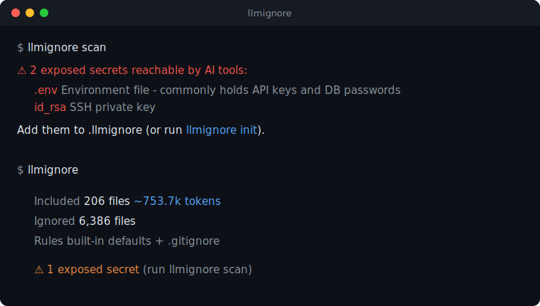

<div align="center">

# llmignore

### Like `.gitignore`, but it tells AI tools what **not** to read.

Secrets, dependencies, build output and binaries should never reach your AI assistant.
`.llmignore` keeps them out — one file, every tool.

[](https://github.com/horiastanxd/llmignore/actions/workflows/ci.yml)
[](https://crates.io/crates/llmignore-cli)
[](https://www.npmjs.com/package/llmignore-cli)
[](LICENSE)

<br>



</div>

---

```bash
$ llmignore scan

⚠ 2 exposed secrets reachable by AI tools:

  .env     Environment file - commonly holds API keys and DB passwords
  id_rsa   SSH private key

Add them to .llmignore (or run `llmignore init`).
```

Your AI assistant reads your whole repo to "understand the codebase." That includes your
`.env`, your private keys, your 200 MB of `node_modules`, and your minified bundles — all
shipped to a model, all eating your context window. `.llmignore` fixes that.

## Why

- **Stop leaking secrets.** `.env`, `*.pem`, `id_rsa`, `.npmrc` — gone from AI context by default.
- **Stop wasting context (and money).** Skip `node_modules/`, `dist/`, lockfiles, binaries. Smaller, sharper context.
- **One file, every tool.** Write `.llmignore` once; `sync` mirrors it to the ignore files 9 AI tools already read - Cursor, Windsurf, Gemini, Aider, Continue, Cline, Roo Code, JetBrains AI Assistant.
- **Native speed.** Built on ripgrep's engine. Scans tens of thousands of files in milliseconds, single static binary, ~2 MB, zero runtime.

## Install

```bash
# npm (no install, just run)
npx llmignore-cli init

# npm (global)
npm install -g llmignore-cli

# Cargo
cargo install llmignore-cli

# curl
curl -fsSL https://raw.githubusercontent.com/horiastanxd/llmignore/main/install.sh | sh
```

> The package is `llmignore-cli`; the installed command is `llmignore`.

## Quick start

```bash
llmignore init     # write a .llmignore with strong defaults
llmignore scan     # any secrets currently exposed to AI? (exit 1 if yes)
llmignore sync     # mirror it into .cursorignore, .aiexclude, ...
llmignore          # summary: what AI sees vs what it skips
```

```text
$ llmignore

llmignore  ~/code/my-app

  Included       206 files   ~753.7k tokens
  Ignored      6,386 files
  Rules      built-in defaults + .gitignore

  ⚠ 1 exposed secret (run `llmignore scan`)
```

That's 206 files going to your AI instead of 6,592. Less noise, no secrets, lower cost.

## The `.llmignore` file

Exactly the same syntax as `.gitignore` — globs, `!` negation, per-directory files, the lot:

```gitignore
# .llmignore
.env
.env.*
!.env.example
*.pem
id_rsa
node_modules/
dist/
*.min.js
*.png
package-lock.json
```

If a repo has no `.llmignore`, llmignore falls back to a comprehensive built-in default
ruleset (secrets, deps, build output, caches, lockfiles, binaries, media, logs). Run
`llmignore init` to drop that ruleset into a file you can edit. `.gitignore` is honored too,
so your existing ignores already apply.

## Commands

| Command | What it does |
|---|---|
| `llmignore init` | Write a `.llmignore` with sensible defaults (`--force` to overwrite). |
| `llmignore scan` | List secret files currently reachable by AI. **Exits 1** if any — drop into CI. |
| `llmignore sync` | Generate the ignore files AI tools read: `.cursorignore`, `.codeiumignore`, `.aiexclude`, `.geminiignore`, `.aiderignore`, `.continueignore`, `.clineignore`, `.rooignore`, `.aiignore`. |
| `llmignore completions <shell>` | Print a shell completion script (bash/zsh/fish/...). |
| `llmignore list` | Print files an AI would read. `--ignored` for the inverse, `--json`, `-0` for `xargs -0`. |
| `llmignore check <file>` | Will an AI read this file? Exit 0 = yes, 1 = ignored. |
| `llmignore stats` | Included vs ignored counts and an estimated token total. |

Global flags: `-C <dir>` (run elsewhere), `--no-gitignore`, `--no-defaults`. `--json` is
available on `scan`, `list`, and `stats` for scripting.

## Use it today

No assistant reads `.llmignore` natively *yet* — so `sync` bridges the gap by writing the
files the tools already respect:

```bash
llmignore init && llmignore sync
```

```text
synced .cursorignore    Cursor
synced .codeiumignore   Windsurf / Codeium
synced .aiexclude       Gemini Code Assist
synced .geminiignore    Gemini CLI
synced .aiderignore     Aider
synced .continueignore  Continue
synced .clineignore     Cline
synced .rooignore       Roo Code
synced .aiignore        JetBrains AI Assistant
```

Edit `.llmignore`, re-run `llmignore sync`, done. Generated files carry a header so re-syncs
update cleanly and never clobber a file you wrote by hand (use `--force` to override).

### Guard your repo in CI

As a GitHub Action - fails the build if a secret is reachable by AI tools:

```yaml
# .github/workflows/llmignore.yml
name: llmignore
on: [push, pull_request]
jobs:
  scan:
    runs-on: ubuntu-latest
    steps:
      - uses: actions/checkout@v4
      - uses: horiastanxd/llmignore@v0.1
```

Or in any pipeline: `npx llmignore-cli scan`.

### As a pre-commit hook

```yaml
# .pre-commit-config.yaml
repos:
  - repo: https://github.com/horiastanxd/llmignore
    rev: v0.1.0
    hooks:
      - id: llmignore-scan
```

### Feed only safe files to any AI CLI

```bash
llmignore list -0 | xargs -0 cat | your-ai-cli
```

## The standard

`.llmignore` is meant to be a simple, shared convention: **a gitignore-syntax file that
tells AI tools what not to read.** If you build an AI coding tool, please read it. The format
is just gitignore — there is nothing new to learn. Issues and proposals welcome.

## Roadmap

- `llmignore bundle` — concatenate the included files into one AI-ready document
- Pre-commit hook for `scan`
- Editor/MCP integrations that read `.llmignore` directly

## Contributing

Built in Rust on the [`ignore`](https://crates.io/crates/ignore) crate. `cargo test` runs the
full suite. PRs welcome — especially new `sync` targets and additions to the default ruleset.

## License

MIT © [horiastanxd](https://github.com/horiastanxd)
